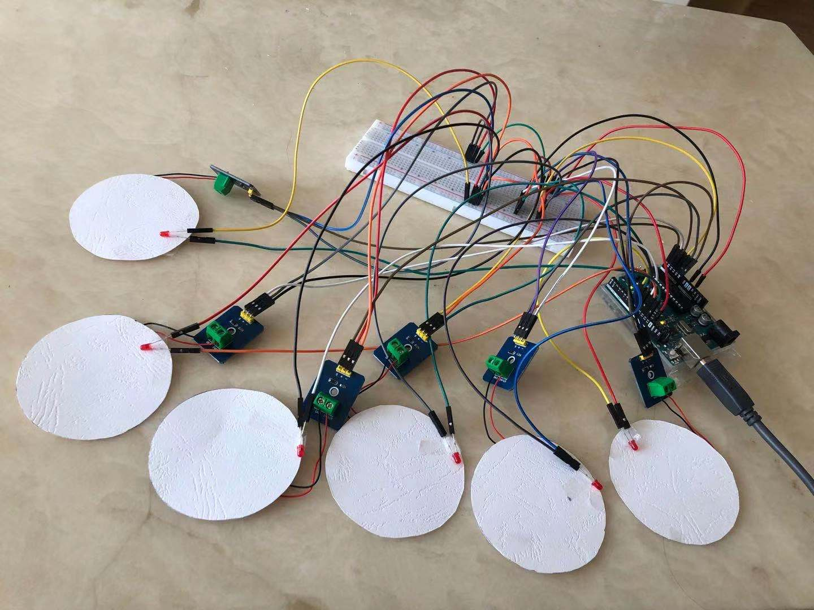
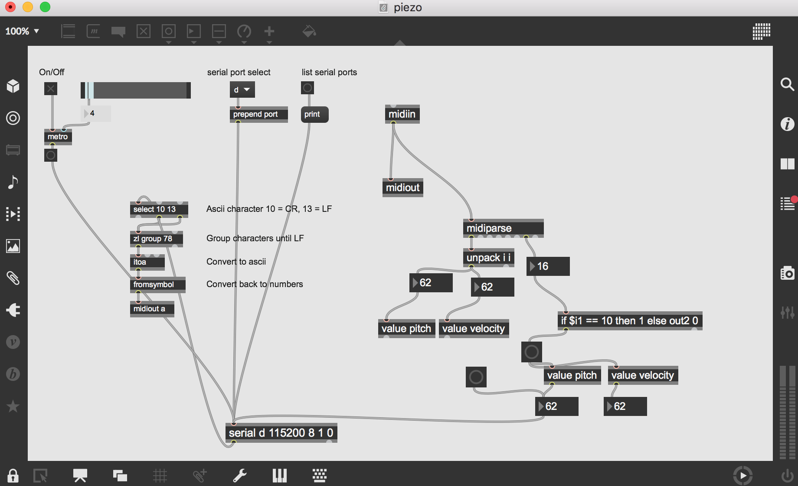
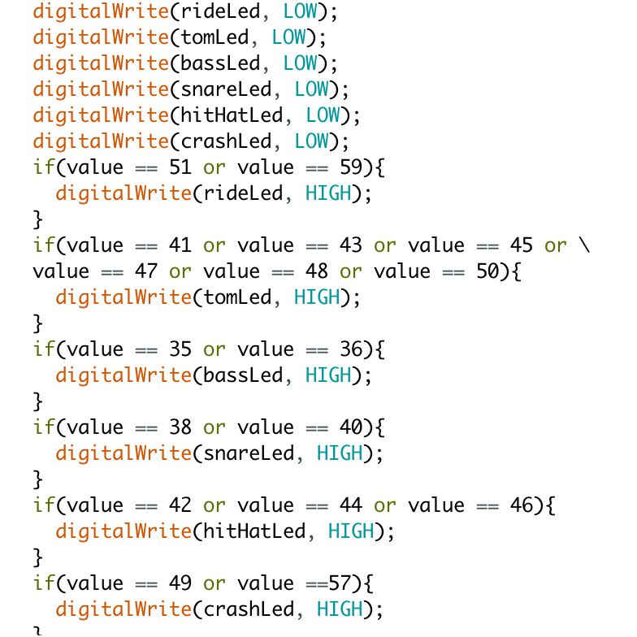

# INTRODUCTION

I have always wanted to learn how to play drums. With everything I have learned in MUMT306, I figured that I can finally make it possible without taking too much space and making too much noises. I decided to make a portable electronic drum kit.  
I plan to make this drum kit helpful for beginner drummers to learn. That's how this design of light-ups comes into my mind. It is based on an arduino piezo drum, plus the functionality that if the user plays a midi file, and a drum key is triggered in the file, the corresponding pad in the drum kit will light up, and the user will be able to follow along playing the drum part with the music. 

# DESIGN & METHOD 
## Hardware

I'm using an Arduino Uno board to implement the hardware side. It mainly consists of two parts - the piezo drum kit and the lights. For each drum piece, I need a piezoelectric sensor connecting to an analog pin for reading. Since there are only six analog pins in an Arduino Uno board, I can only include six pieces for my drum kit, so I took off some toms and only left a floor tom in my kit. As show in the image above, from left to right, I have crash cymbal, hi-hat, snare drum, bass drum, floor tom and ride cymbal.  
The connection of LED lights is straight forward. One side is to the digital pin and the other is to the ground. Each light is placed right at the edge of each drum pad. And that completes my circuit. 
## Software
To trigger the lights, I use [RtMidi](https://www.music.mcgill.ca/~gary/rtmidi/) in C++ to read the midi file. It passes the data to Max, and Max filters and passes the data to Arduino. For the drum notes part, I send the data readings from the analog pins from Arduino to Max directly. Max is also used to sound out both the notes from the file and the drum notes being played.  
Here is a screenshot of the Max patcher. 

The left side of the patcher is sending data from Arduino to Max, and the right side checks if the incoming message is a percussion note and sends the pitch to Arduino if so. The pitch represents a percussion instrument in general midi. If the pitch coming in matches the type of a drum piece, the light will be on for that piece. Since general midi has way too many percussion instruments, and we can only include six. I turn the light on as long as they roughly match, as shown in the screenshot below. For example, all types of tom from the midi file all trigger the light of floor tom in our piezo kit.

Since pressing the piezo sensor gives a range of values, we need a threshold to ensure only one sound is produced every time we hit the drum pad. Through experiments, I chose 80 as my threshold value. I also scaled the readings from analog pins, and used them as the velocity of the midi messages we send, so they behave more like regular drums - the harder they get hit, the louder they get.
# DEMO 1
Here is a [video](https://youtu.be/JguaIu-2GNw) testing the piezo drum itself. 
Here is a [video](https://youtu.be/OgUzo6It5Sk) playing the drums while a midi file is played.

# IMPROVEMENT
A problem I found when testing the device is that the lights flash out so fast, and it is very hard for people to catch a good number of notes. A possible solution I came up with is to slow down the playing speed of the midi file, so I added an optional speed argument in my c++ program. By default, the file is played at the normal speed. If you add an extra argument when running the c++ program in the terminal, the file will be played at that speed instead. The DEMO 2 below shows an example of playing the midi file with a speed parameter of 0.5.
# DEMO 2
Here is a [video](https://youtu.be/Vw5fl9Twc7Q) playing the drums while playing the midi file at half speed.

# CONCLUSION
Overall, my project does what I expect it to do. I hope people can have fun and get a good sense of rhythm and beats playing around with it. I'm still looking for ways to make this device a better fun tutorial platform for beginner drummers. An idea I have for now is maybe instead of leaving the next note hanging in the air, I can have a screen showing what notes are coming within a certain time frame. I will update this page if I add anything new to my drum kit!
